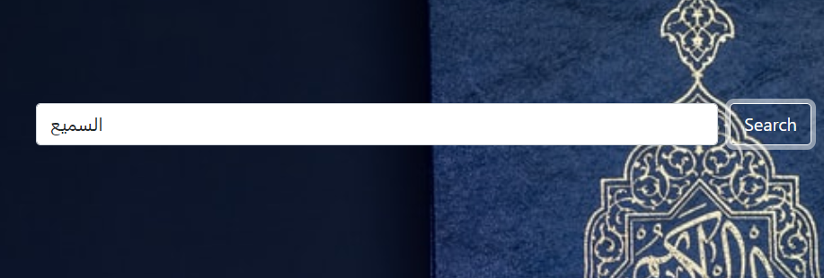
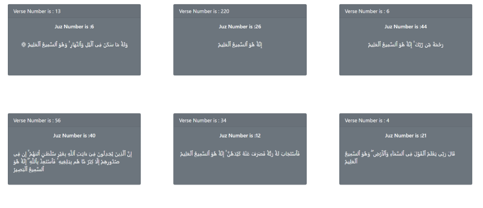

[](https://hits.seeyoufarm.com)

# Quran Finder

> The Quran Finder is a website helps you if you wanna search for anything in The holy quran, and its shows the matches and how many matches did it find

## Preview




## Live Demo

[Live Demo Link](https://iammouaz.github.io/Quran-Finder/)

## Built With

- Bootstrap
- Javascript
- Webpack

## Getting Started

- Run git clone on this project at the desired directory:
   ```
   git clone https://github.com/iammouaz/Quran-Finder.git
   ```
- Run `npm install` to install the necessary packages to run locally
- After installing everything, run `npm start` and your default browser will open with the page

### Prerequisites

An updated web browser

### Usage

- Type the score and your name in the text field and submit
- Watch your score on the list and check who is better. 


## Authors

👤 **Mouaz El Molkey**

- GitHub: [](https://github.com/iammouaz)
- Twitter: [](https://www.twitter.com/MoazMulki1/)
- LinkedIn: [](https://www.linkedin.com/in/mohammad-mouaz-molki-1368981bb/)

## 🤝 Contributing

Contributions, issues, and feature requests are welcome!

Feel free to check the [issues page](../../issues/).

## Show your support

Give a ⭐️ if you like this project!

## Acknowledgments

To everyone.
